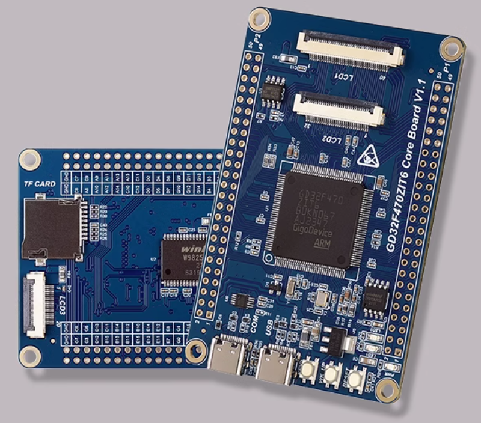

## GD324xx RT-Thread

### 简介
该仓库是基于`GD32F470ZIT6`开发板的[WiFi-Host-Driver](https://github.com/Evlers/rt-thread_wifi-host-driver)测试项目，也可作为物联网开发使用的模板，可以更简单方便的开发物联网程序。

### 开发板介绍



该开发板常用 **板载资源** 如下：

- GD32F470ZIT6
- On-board USB To UART(CH340)
- USB OTG with Type-C connector
- SDIO TF Card slot
- RGB565 FPC connector
- I8080 FPC connector
- SPI LCD FPC connector
- 32Mbytes SDRAM
- 16Mbytes SPI FLASH
- 256bytes EEPROM
- Power LED(blue) for 3.3 v power-on
- Two user LED1(RED), LED2 (Green)
- Three push-buttons (user and wake and reset)

### 使用说明

由于该项目中的`rt-thread`目录为`submodule`，需要在`clone`的时候加上`--recurse-submodules`选项。


#### 硬件连接

- 使用调试器连接开发板到 PC，使用USB2TTL连接UART3(PA0&PA1)，并给开发板供电。
- 不建议使用板载的USB2TTL，因为板载的CH340连接了RTS到MCU的NRST引脚，使用引脚流控会复位芯片。
- 将`英飞凌模组TF板卡`插入到开发板的TF卡接口，并将板卡的`WL_REG_ON`连接到`PC4`引脚，以及板卡的`WL_HOST_WAKE`连接到`PC5`引脚。

#### 编译下载

- 建议在打开MDK5工程之前先通过`scons --target=mdk5`命令重新生成工程文件。<br>
- 双击 projects 目录中的 project.uvprojx 文件，打开 MDK5 工程，编译并下载程序到开发板。

**注意：该项目使用的是FAL方式加载WiFi资源文件，请参考[WiFi-Host-Driver](https://github.com/Evlers/rt-thread_wifi-host-driver)中的`README.md`文件下载资源文件到开发板**

#### 运行结果

下载程序成功之后，系统会自动运行，LED 闪烁。

连接开发板对应串口到 PC , 在终端工具里打开相应的串口（115200-8-1-N），复位设备后，可以看到 RT-Thread 的输出信息:

```bash
 \ | /
- RT -     Thread Operating System
 / | \     5.0.2 build Jul  8 2024 21:57:48
 2006 - 2022 Copyright by RT-Thread team
lwIP-2.0.3 initialized!
[I/FAL] RT-Thread Flash Abstraction Layer initialize success.
[Flash] EasyFlash V4.1.0 is initialize success.
[Flash] You can get the latest version on https://github.com/armink/EasyFlash .
[I/sal.skt] Socket Abstraction Layer initialize success.
[I/FAL] The FAL block device (filesystem) created successfully
msh />RT-Thread WiFi Host Drivers (WHD)
You can get the latest version on https://github.com/Evlers/rt-thread_wifi-host-driver
WLAN MAC Address : C0:AE:FD:00:10:4B
WLAN Firmware    : wl0: Jul 31 2023 06:07:24 version 13.10.271.305 (f2b5c53 CY) FWID 01-e6b954e
WLAN CLM         : API: 18.2 Data: 9.10.0 Compiler: 1.36.1 ClmImport: 1.34.1 Creation: 2022-08-16 03:35:21
WHD VERSION      : 3.1.0.23284 : v3.1.0 : ARM CLANG 5060960 : 2024-03-21 22:57:11 +0800
[I/WLAN.dev] wlan init success
[I/WLAN.lwip] eth device init ok name:w0
[I/WLAN.dev] wlan init success
[I/WLAN.lwip] eth device init ok name:w1
```

### 进阶使用
本项目使用的是离线包的方式。<br>
为防止在线包与离线包的配置产生冲突，该工程已经在根目录的`Kconfig`文件中注释了在线包配置的加载。<br>
如果需要下载在线软件包，则需要先将`source "$PKGS_DIR/Kconfig"`的注释取消，然后开始下载线上软件包操作。<br>

**制作离线软件包**
- 先将根目录`Kconfig`文件中的`source "$PKGS_DIR/Kconfig"`注释取消，使用在线包的`Kconfig`文件。
- 注释掉根目录`Kconfig`文件中的`source "$OFFLINE_PKGS_DIR/Kconfig"`，防止与在线包的配置冲突。
- 在根目录下打开`env`工具，输入`menuconfig`命令配置工程，选中了需要的在线包之后保存退出。
- 输入`pkgs --update`命令下载刚刚选中的在线软件包。
- 将下载的`软件包`移动到 `offlin-package` 目录中，并删除软件包内的 `.git` 文件夹。
- 复制`env`工具里面的`packages`目录下对应包的`Kconfig`文件到软件包中，并在上一级目录加入该软件包的`Kconfig`路径。
- 完成离线包制作后，再次注释根目录下`Kconfig`文件的`source "$PKGS_DIR/Kconfig"`防止配置冲突。
- 再次取消根目录下`Kconfig`文件的`source "$OFFLINE_PKGS_DIR/Kconfig"`注释，使用离线包的`Kconfig`文件。
- 删除项目中的`packages`目录，防止加载重复的软件包。

**离线包使用**
- 在根目录下打开`env`工具。
- 输入`menuconfig`命令配置工程。
- 进入`RT-Thread offline packages`中配置离线软件包，配置好之后保存退出。
- 输入`scons --target=vsc/mdk5` 命令重新生成工程。

